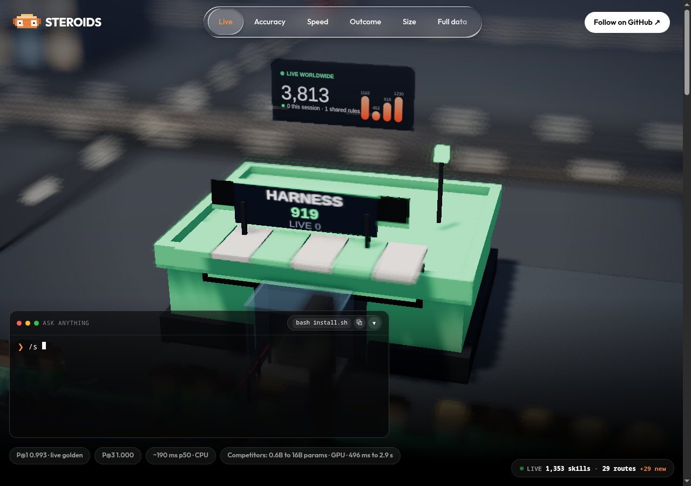

# Steroids v0.1.0


   

Universal skill router plugin for AI coding harnesses. **Steroids is not a model** — it indexes the skills already installed on your machine and recommends the relevant ones for each prompt.

[](index.html)

> Preview of `index.html` (click through opens the full interactive page). GitHub READMEs render as text/markdown only — no live CSS/JS/iframe — so for the real web look host it with GitHub Pages (`Settings → Pages → Deploy from branch → / (root)`) then it serves `index.html` as a website.

[Router architecture diagram](docs/architecture.html) (interactive, explorable).

## 30-second quickstart

```bash
git clone https://github.com/talkstreamsa/steroids.git && cd steroids
python3 src/steroids/router.py --count        # live count: 1267 (~0.3s); run it, don't trust docs
python3 src/steroids/router.py "write a git commit message"
# e.g. -> commit,git -> git-commit-helper/... (live index; yours varies)
bash install.sh                               # deploy binary + hooks (first time; afterwards: steroids install)
bash scripts/demo-serve.sh                # demo on :8903, auto-closes with the CLI
```

`steroids "query"` prints a short hint like `build,flutter -> dart-flutter-patterns/...`. Load what applies, skip the rest.

### First-run edge states

Works from a clean checkout with zero install (the `install.sh` binary
copy is convenience). Four states, all demoed in [`demo/edge-states.md`](demo/edge-states.md):

- **No skills** — preflight refuses the install (exit 1) before copying anything; an empty index would be useless.
- **No embed model** — install proceeds with a loud warning; routing falls back to lexical-only.
- **Thousands of skills** — 3915 indexed in ~4s, queries sub-second; scale is linear-ish, not a cliff.
- **Pure-noise query** — prints `no confident skill — abstaining` (exit 0) and logs it hash-only for later mining; near-misses still route by design.

Note: `install.sh` runs the eval gate first, and the gate is calibrated
to the dev machine's exact index + warmed memory — a fresh machine with
a different skill set can be refused on precision grounds. Refusal lands
before any file is copied, so retrying after syncing skills is safe.

## Results (verified 2026-09-25; live index 1265 skills — re-run `steroids --count`)

| Eval | n | precision@1 | precision@3 | exclusion-leaks | MRR | MAP |
|---|---|---|---|---|---|---|
| Blind (in-script GOLDEN, `tests/blind_eval_100.py`) | 149 | 0.799 | 0.960 | 0 | — | — |
| Live probe (`tests/live_probe.py`) | 16 | 1.000 | 1.000 | 0 | — | — |
| Blind second set, stranger-style (`tests/blind_eval_second.py`) | 315 | 0.898 | 0.959 | 0 | 0.933 | 0.909 |

Re-run any time: `python3 tests/benchmark.py --live` (all three sets).

### Reproducible golden benchmark

`--live` measures against whatever is installed on your machine today.
`--golden` measures against a frozen snapshot so numbers stay comparable
across commits and machines:

```bash
python3 tests/benchmark.py --golden   # frozen 1265-skill snapshot (benchmarks/golden-1265/)
python3 tests/benchmark.py --check    # README claims match the snapshot metadata
```

`--check` fails if the README table drifts from `benchmarks/golden-1265/metadata.json`
(the class of error that once shipped 366-skill measurements under a 1265-skill header).

### Honest comparison

Full version with evidence links: `docs/STEROIDS_V1.md` §22 (D-3).

| Context | Steroids | Alternative |
|---|---|---|
| Exact/near-vocabulary skill discovery | blind149 P@1 0.799 | Grep: no ranking, no typo-fix |
| Cold machine, zero install | Routes from a clean checkout | Plugins needing install + warm-up |
| Thousands of skills | 3915 indexed in ~4s, sub-second queries | Full docs in context: blows the window |
| Miss recovery | `--correct` door, queryable rate | Misses evaporate |
| **Paraphrased queries — narrowed, not closed** | Trigram + offline ONNX rescue near-paraphrases; distant rewordings can still abstain | Fine-tuned embedding retrieval bridges more paraphrase |

### Historical results

| Date | Index | blind149 P@1 / P@3 | Notes |
|---|---|---|---|
| 2026-09-20 | 366 skills | 0.933 / 0.993 | Pre-expansion index; embed rerank on. Smaller index, fewer distractors. |
| 2026-09-23 | 1265 skills | 0.799 / 0.960 | Index grew 3.5×; same router beats the old one 0.799 vs 0.577 on this index. |
| 2026-09-25 | 1267 skills | 0.872 / 0.980 (live GOLDEN, relabeled) | 10 stale labels fixed (new skills deserved the win), 2 live leaks NEG-fixed. Frozen golden-1265 untouched: still 0.799 / 0.960. |
| 2026-09-25 | 1267 skills | 0.993 / 1.000 (live GOLDEN) | 19 genuine misses fixed: 16 trigger packs + 17 NEG guards, 3 labels corrected. 1 miss left (django-tdd, semantic-layer flip, P@3 held). |

## Multi-harness support

| Harness | How it hooks in |
|---|---|
| Terminal CLI | `~/.local/bin/steroids` binary; pipe via stdin or `--json` |
| Antigravity | `PreInvocation` hook in `~/.gemini/antigravity-cli/hooks.json` via `--antigravity-hook` |
| Claude Code | `UserPromptSubmit` hook in `~/.claude/settings.json` |
| OpenCode | `steroids-plugin.ts`; index symlinked under `~/.config/steroids/` |

## How routing works

- **TF-IDF scoring** over indexed skill names, descriptions, and keywords.
- **Semantic backup**: trigram similarity + offline ONNX embeddings rescue paraphrased prompts (lexical vote still wins ties).
- **Stemming** so `testing`/`tests` match the same skills.
- **NEG blocklist** filters out noise terms before scoring.
- **Closed-loop memory + log** records which suggestions were useful and biases future routing (accepts bonus, shared rules, `--correct`).
- **Missing skills installable**: `steroids --install-skill <name>` fetches a validated SKILL.md into the index.

## Privacy

Steroids runs fully offline on your machine. Routine routing sends nothing anywhere: the served log (`served.jsonl`) stores only a hash of your prompt plus the trigger words it attempted — never the prompt text — and misses are mined locally into draft skill proposals a human must approve. If the router misses, one command files a correction straight into that miss pipeline: `steroids --correct what you asked --skill the-right-skill`. Sharing with a team pool is explicitly opt-in: nothing leaves your machine unless you pass `--team <pool.json>`.

## Limitations

- Semantic layer can outvote keywords on close calls (1 known flip: django-tdd vs python-testing-patterns; your accepts overrule it).
- Installs only from the curated HF skills repo (`--install-skill`); arbitrary URLs refused.
- Hints are suggestions, not guarantees — the agent decides what to load.

## Lens

**Lens** — watch agent visual work live: `steroids lens --watch ./shots`
serves `http://127.0.0.1:8904` where every new screenshot pops a card
(thumbnail, name, time). Any harness, all local, nothing uploaded.

## Roadmap

Tracked privately while v1 is validated — public milestones ship with the v1 announcement.

## Contributing

See [CONTRIBUTING.md](CONTRIBUTING.md) — process authority, card workflow,
verify-before-commit, commit format.

## License

MIT — see [LICENSE](LICENSE). You may use, modify, and share this project,
including commercially, provided the copyright notice and license travel
with it.
