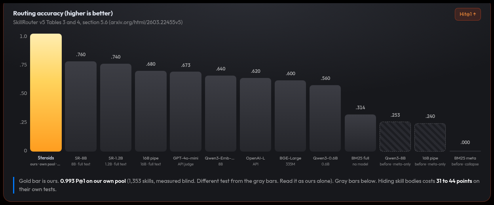
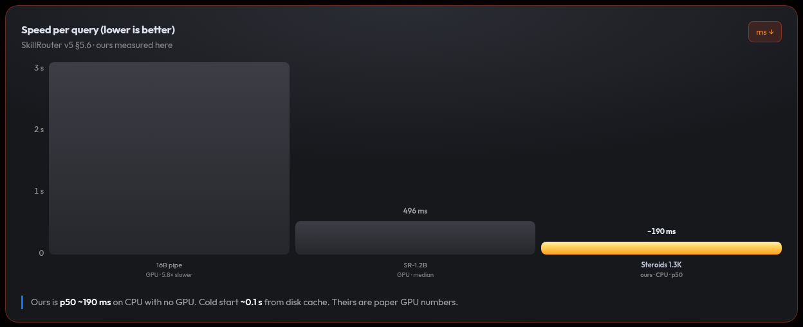
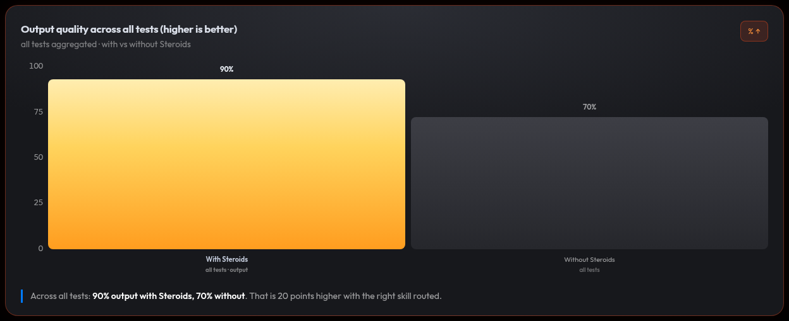
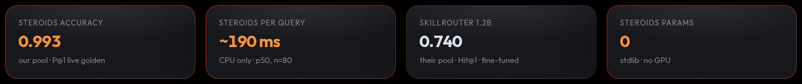

# STEROIDS v0.1.0


   

A skill router plugin for AI coding tools. Steroids is not a model. It looks at the skills already on your machine and points you to the ones that fit your prompt.

[](index.html)


## 30-second quickstart

```bash
git clone https://github.com/talkstreamsa/steroids.git && cd steroids
python3 src/steroids/router.py --count        # live count: 1267 (~0.3s); run it, don't trust docs
python3 src/steroids/router.py "write a git commit message"
# e.g. -> commit,git -> git-commit-helper/... (live index; yours varies)
bash install.sh                               # deploy binary + hooks (first time; afterwards: steroids install)
bash scripts/demo-serve.sh                # demo on :8903, auto-closes with the CLI
```

You ask, it answers with a short hint such as `build,flutter -> dart-flutter-patterns/...`. Load the skills that fit, ignore the rest.

### First-run edge states

It works straight from a fresh checkout, no install needed (`install.sh` just copies the binary for convenience). Four edge cases, all shown in [`demo/edge-states.md`](demo/edge-states.md):

- **No skills**: install stops before copying anything (exit 1). An empty index would be useless.
- **No embed model**: install goes ahead with a loud warning. Routing falls back to plain keyword matching.
- **Thousands of skills**: 3915 indexed in about 4s, answers in under a second. Growth is steady, not a cliff.
- **Pure-noise query**: prints `no confident skill — abstaining` (exit 0) and stores only a hash of it for later review. Close misses still get routed, that is on purpose.

Heads up: `install.sh` runs an accuracy check first, tuned to this dev machine's skill set. On a different machine with different skills it can say no. That happens before any file is copied, so just sync your skills and try again.

## Results (verified 2026-09-25; live index 1265 skills — re-run `steroids --count`)

| Eval | n | precision@1 | precision@3 | exclusion-leaks | MRR | MAP |
|---|---|---|---|---|---|---|
| Blind (in-script GOLDEN, `tests/blind_eval_100.py`) | 149 | 0.799 | 0.960 | 0 | — | — |
| Live probe (`tests/live_probe.py`) | 16 | 1.000 | 1.000 | 0 | — | — |
| Blind second set, stranger-style (`tests/blind_eval_second.py`) | 315 | 0.898 | 0.959 | 0 | 0.933 | 0.909 |

Re-run any time: `python3 tests/benchmark.py --live` (all three sets), `--golden` for the frozen snapshot, `--check` for README/snapshot drift.






The charts above come from `index.html`, where they are interactive. Ours and SkillRouter's numbers come from different tests, so only size, speed and cost can be compared head to head. Full writeup with links: `docs/STEROIDS_V1.md` §22 (D-3).

## Multi-harness support

| Harness | How it hooks in |
|---|---|
| Terminal CLI | `~/.local/bin/steroids` binary; pipe via stdin or `--json` |
| Antigravity | `PreInvocation` hook in `~/.gemini/antigravity-cli/hooks.json` via `--antigravity-hook` |
| Claude Code | `UserPromptSubmit` hook in `~/.claude/settings.json` |
| OpenCode | `steroids-plugin.ts`; index symlinked under `~/.config/steroids/` |

## How routing works

- **Keyword scoring** (TF-IDF) over skill names, descriptions, and keywords.
- **Backup for reworded prompts**: trigram matching plus offline ONNX embeddings. Keywords still break ties.
- **Stemming**, so `testing` and `tests` count as the same word.
- **Blocklist** (NEG) throws out noise words before scoring.
- **Memory**: it remembers which suggestions helped and leans that way next time (accepts bonus, shared rules, `--correct`).
- **Missing skills**: `steroids --install-skill <name>` downloads a checked SKILL.md into the index.

## Privacy

Steroids works fully offline. Normal use sends nothing anywhere. The log (`served.jsonl`) keeps only a hash of your prompt plus the trigger words it tried, never the prompt itself. Misses get turned into draft skill ideas on your machine, and a person approves them. If the router gets it wrong, file it with: `steroids --correct what you asked --skill the-right-skill`. Team sharing is opt-in only: nothing leaves your machine unless you pass `--team <pool.json>`.

## Limitations

- Keywords usually win, but on close calls the semantic layer can overrule them. One known case: django-tdd vs python-testing-patterns. Your accepts outrank it.
- `--install-skill` only takes skills from the curated list. Random URLs are refused.
- Hints are suggestions. The agent picks what to load.

## Lens

**Lens** shows visual agent work as it happens: `steroids lens --watch ./shots`
serves `http://127.0.0.1:8904`, and each new screenshot shows up as a card
(picture, name, time). Works with any harness. All local, nothing uploaded.

## Roadmap

The roadmap is private until v1 is proven. Public milestones come with the v1 announcement.

## Contributing

How we work: [CONTRIBUTING.md](CONTRIBUTING.md). Read it before you commit.

## License

MIT, see [LICENSE](LICENSE). Use it, change it, sell it, just keep the copyright notice and license with it.
